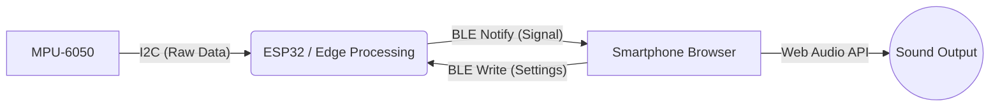

# Automated Bench Press Judge (IoT Device)

パワーリフティングのベンチプレス競技における「静止判定（Press Call）」を、加速度センサーを用いて定量的に自動判定するIoTデバイス。

## Demo

[**Launch Web App (Demo)**](https://hayate5967.github.io/AutomatedBenchpress/)
## Features

* **Real-time Stillness Detection:** 3軸加速度の合成ベクトルと分散を監視し、競技ルールに準拠した「胸上での静止」を検知。
* **Low Latency Feedback:** BLE (GATT) 通知を使用し、判定から0.1秒以内にスマートフォン側で音声コマンドを再生。
* **Bi-directional Control:** Webブラウザから判定までの「静止時間」を変更可能。
* **Serverless Architecture:** 専用アプリやバックエンドサーバーを必要とせず、ブラウザのみで完結（PWA対応）。

## Tech Stack

| Category | Technology |
|:--- |:--- |
| **Microcontroller** | ESP32 Dev Module |
| **Sensor** | MPU-6050 (6-axis Accelerometer/Gyroscope) |
| **Protocol** | Bluetooth Low Energy (BLE) |
| **Firmware** | C++ (Arduino Framework) |
| **Frontend** | HTML5, JavaScript (Web Bluetooth API) |
| **Hosting** | GitHub Pages |

## System Architecture



## Algorithm

誤検知（ラックアップ時の振動や、下降中の揺れ）を防ぐため、単純な閾値判定ではなく状態遷移で実装。

### 1. Preprocessing (Data Normalization)
センサーからのRawデータを加工し、3軸合成ベクトルのノルム($|A|$)を算出。

$$|A| = \sqrt{a_x^2 + a_y^2 + a_z^2}$$

### 2. State Machine Logic
* **STATE_TOP_HOLD (Rack Position):**
  * モーション検知閾値 ($\Delta > 0.2G$) を超えた場合、試技開始（下降）とみなす。
* **STATE_DESCENDING (Motion):**
  * 下降動作中。合成ベクトルの変動幅が静止閾値 ($\pm 0.15G$) 以内に収まると、静止タイマーを開始。
* **STATE_PRESS (Judgment):**
  * 設定時間（Default: 600ms）静止状態が継続した場合、BLE経由で判定信号を送信。

## Directory Structure

```text
AutomatedBenchpress/
├── firmware/          # ESP32 Firmware (C++)
│   └── main/
│       └── main.ino
├── docs/              # Web Application (HTML/JS)
│   └── index.html     # Hosted on GitHub Pages
└── README.md          # Documentation
```

## Usage

1.  **Hardware Setup:**
    * MPU-6050をESP32に接続します (SDA: GPIO21, SCL: GPIO22)。
    * `firmware/main/` にあるコードをESP32に書き込みます。
2.  **Web App:**
    * BLE対応ブラウザ（例: iOSならBluefy、AndroidならChrome）でデモURLを開きます。
3.  **Connection:**
    * 「CONNECT DEVICE」をタップし、`BenchPressMonitor` を選択します。
    * デバイスをバーベル（端部）に取り付けます。

## Future Work
* Firebase (Firestore) などと連携し、挙上重量と成功率のデータをクラウドに蓄積・可視化する。
* pressの回数をカウントできるようにする。
* OutPut Callのボイスを変更できるようにする。
* バーベルにしっかり固定するための専用アタッチメントの作成(3Dプリンタなど)。

　　

